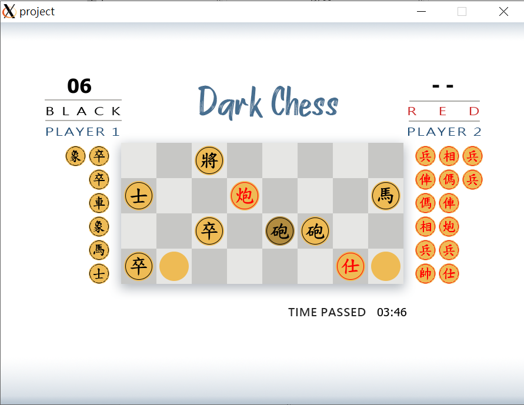
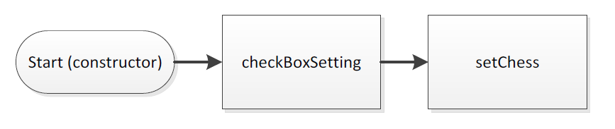
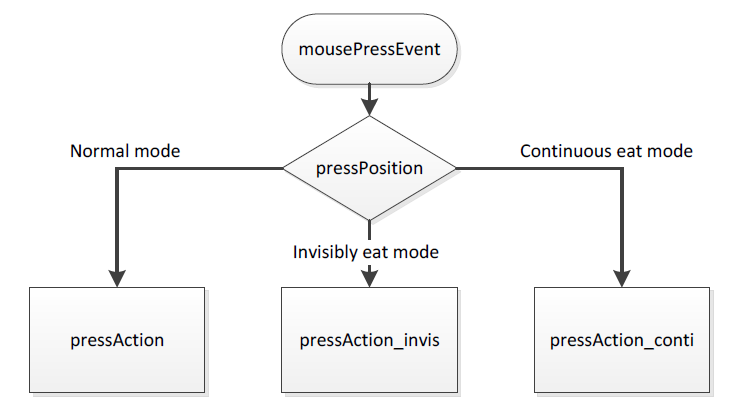
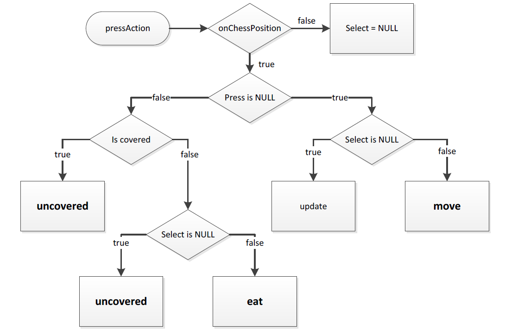
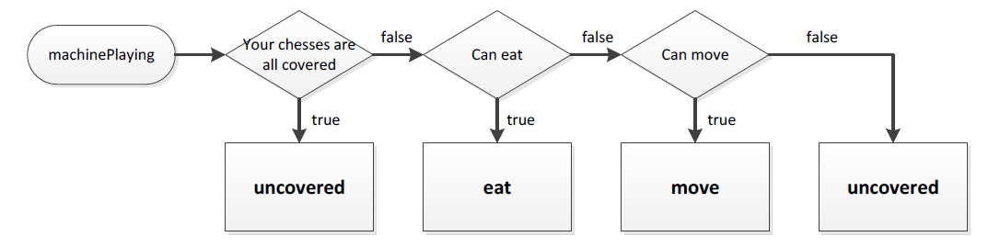

# Dark chess

*A chess game written in C++ and Qt.*

- **How to compile and run in cygwin**

```
$ startxwin
$ export DISPLAY=:0.0
$ make
$ make clean
$ ./project.exe
```

- **How to play**
  - Press **START** in the menu to start the game.
  - Flip, drag, capture the chess by your mouse.
  - Make a move within 15 seconds.
  - It would be tie if there is no capture in 15 rounds.
    
  
- **How it works**
  - Setup
    

  - `mousePressEvent()`
    

  - `pressAction()`
    

  - `machinePlaying()`
    
  